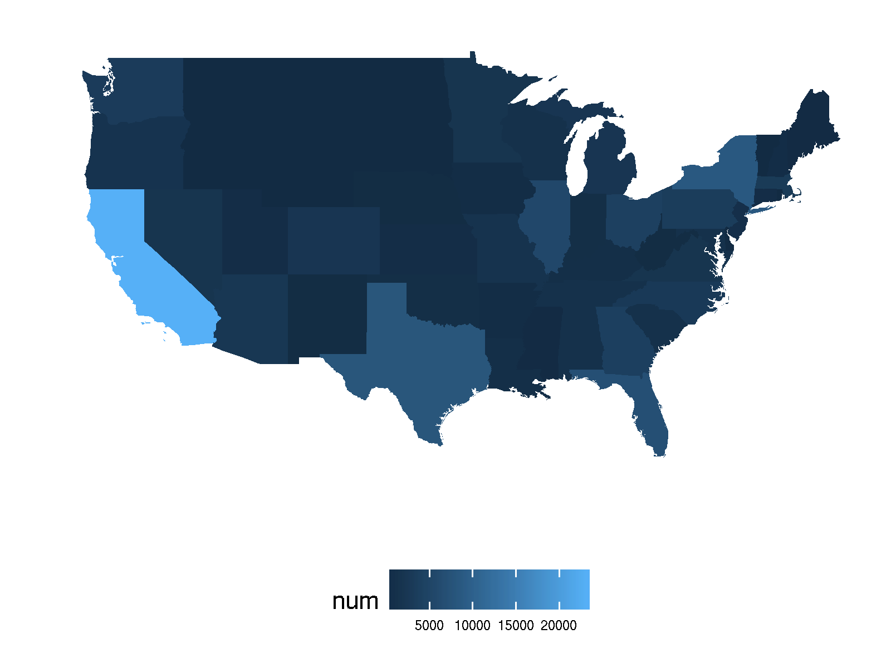
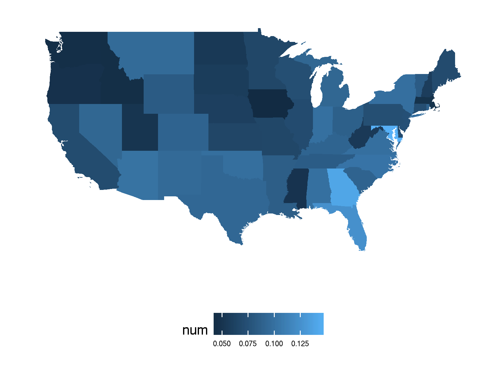

==========
Project 09
==========

Adam Frick

CSCI 403

|

Twitter is a website where many people write 150-character messages to friends
and enemies alike. All walks of life tend to participate, which makes it novel
to analyze how people behave and communicate with one another as a whole.
Analyzing data in aggregate is a common topic in research due to the
ubiquity of the internet and the means to do it. Big Data and Machine Learning
are the powerhouses of such findings. Unfortunately, I know little of either.
However, I thought it would be cool to see how even simple analyses can reveal
a lot about the social media demographic.

SQL is a pretty prevalent topic for the course; therefore, the main technology
used for data collection and analysis is PostgreSQL. I chose not to alter any
of the data sources put into the database whenever possible, opting instead to
alter it after copying. This is to provide coherent modification of the
datasets, and to demonstrate how the PostgreSQL elephant is up to any task.

Three data sources were used to associate a location to a tweet. It's hard to
find a good word to associate "area within a state that can be a city, town,
village, etc" to, so I'll refer to all of them as cities. The first source, the
most substantial, is the actual scraping of millions of tweets from late 2009
with its respective user ID and location of the tweeter [1]_. The source
asks only to cite their paper if the dataset is used, which has been done. The
data is split into two files, the first for tweet information, including the
tweet itself and when it was tweeted:

.. code-block::

    user_id   tweet_id    tweet                       date & time
    ---------------------------------------------------------------------
    30015494  2643369016  Students Build Hydroge...  2009-07-14 20:56:22
    30015494  2600384468  A review of @thedandyw...  2009-07-12 11:47:54
    30015494  2524548381  @enutter let me resear...  2009-07-07 20:10:47
    30015494  2524540643  @martinealice D'accord...  2009-07-07 20:10:16

The second file is for user information, including where the tweeter is
located:

.. code-block::
    
    user_id   location
    --------------------------
    37750115  New York
    78119142  Orlando, Florida
    90178948  Mesa
    15730053  Austin, TX
    22021521  Boston, MA
    31458706  New Orleans, LA

There were a few issues with the dataset which necessitated the use of two
other data sources, which is understandable given the size and source.
 
Misspelling and inconsistent letter case of locations were not an issue, but
rather the location being incomplete. Often enough, twitter users only provide
their city rather than their city *and* state. Sure, it's obvious that New York
City is in New York, but what if a state is omitted because there's only one
city with that name among a twitter's circle of followers? While the former is
the common case and will prove most useful, but the latter may also occur. For
example, there are 30 twitter users from Springfield who did not include their
state. 35 states have a city called Springfield. How will we know which one
they're from? Through extrapolation!

To complete the users' city and state correspondence, another data set is used:
the United States Census from 2010 [2]_. This data being
government-derived, the data is likely in the public domain as the site does
not seem to impose any restrictions on the use of such data. 

|

This data opens another can of data worms. Not only is every town and city
included in the mix, but townships, counties, and even states themselves. Lots
of unnecessary columns are present as well, so much so that it's difficult to
embed the table. I'll decompose it into two column groups to remedy this:

.. code-block::

    SUM  ST  CTY  PLACE  C-SUB  C-IT  FL STT NAME          STNAME   2010POP
    040  01  000  00000  00000  00000  0  A  Alabama       Alabama  4779736
    162  01  000  00124  00000  00000  0  A  Abbeville...  Alabama  2688
    162  01  000  00460  00000  00000  0  A  Adamsvill...  Alabama  4522
    162  01  000  00484  00000  00000  0  A  Addison town  Alabama  758
    162  01  000  00676  00000  00000  0  A  Akron town    Alabama  356
    162  01  000  00820  00000  00000  0  A  Alabaster...  Alabama  30352

    BASE2010  EST2010  EST2011  EST2012  EST2013  EST2014  EST2015  EST2016
    4780131   4785492  4799918  4815960  4829479  4843214  4853875  4863300
    2688      2683     2685     2647     2631     2619     2616     2603
    4522      4517     4495     4472     4447     4428     4395     4360
    756       754      753      748      748      747      740      738
    356       355      345      345      342      337      337      334
    31066     31176    31362    31663    31960    32167    32751    32948

Which locations to remove is arbitrary, but some things that definitely
need to go are the states and counties. Luckily, the data set has a special
column that identifies it as such (e.g. if the very first column is '040', then
it is a state). However, each non-state location name is *prefixed* or
*postfixed* by what kind of location it is. For example, 'Denver' is referred
to as 'Denver City'. I assume most twitter users will use the former term in
regard to this location. Due to consistent casing that differentiates the
location marker to the location name itself ('Salt Lake City city' is an actual
entry), removing them with case- and location-sensitive keywords is no big
deal. Regex to the rescue!

.. code-block:: SQL

    -- remove those pesky postfixes
    UPDATE state_pops_temps SET city =
    (regexp_split_to_array(city,
        ' (?:city|town|village|Borough|Municipality
          |municipality|Town|borough|plantation)'))[1];

There are all sorts of postfixes that the census adds to the population data,
and one regular expression can rule out any that are requested. It captures the
postfix as a separator of the location string, and taking the first element of
that result removes the postfix and anything after it. 

Now that city and state population data set has been made compatible with the
existing data, it can now be used to extrapolate the missing states. I give the
tweeters the benefit of the doubt and assume they refer to the most-populous
city they name, if the disambiguation is necessary (usually isn't). 

Another table is populated that consists of unique city names, whose cities
happen to be the most populous in the United States by that name.  This makes
it easy and fast to query against city and entries for tweeters without a
state.

.. code-block:: SQL

    -- get unique cities with the highest population
    INSERT INTO biggest_cities
    SELECT s1.city, s1.state FROM state_pops_temps AS s1
    INNER JOIN state_pops_temps AS s2
    ON s1.city=s2.city
    GROUP BY s1.city, s1.state, s1.pop
    HAVING MAX(s2.pop)=s1.pop;

    -- infer that tweeters that didn't specify a state live in the
    -- most populous city they refer to
    UPDATE tweeters SET state=bc.state FROM biggest_cities AS bc
    WHERE tweeters.state='' AND bc.city=tweeters.city;

There's just one more unfinished task for tweeter data: abbreviation. Twitter
users can either abbreviate or provide the full state name for their respective
state. This makes for an inconsistent data set. Annoying. But it can be fixed
by throwing in more data sets! It's a simple one too; mapping states'
abbreviations to their full name [3]_. Licensing is a moot point as this
data is not a creative work and is readily available. 

After collecting the entries, all that has to be done is finding state entries
that match up with the abbreviation, and replace them with the full names. 

.. code-block:: SQL

    -- all states now use abbreviations rather than full names
    UPDATE tweeters
    SET state=states.abbrev FROM STATES
    WHERE tweeters.state=states.state;

They're full now. That's my query!

With user IDs associated to locations to the best of our ability, the tweets
now need to be associated with the user IDs. Seeing how both are from the same
data set, it should be easy to parse into PSQL, right? ... No. This wasn't the
case at all, to the point where PSQL even needs external help for its input
data. For example, most tweets have an associated date, but some don't:

.. code-block:: bash

    $ egrep -v "[0-9]{2}:[0-9]{2}:[0-9]{2}\s" 
      <training_set_tweets.txt | wc -l
    100682

    $ wc -l training_set_tweets.txt 
    3845622 training_set_tweets.txt

3,845,622 tweets have the date, but 100,682 don't. That's a lot, but is
proportionally insignificant. PSQL's `\copy` macro can't handle this, so I'll
have to make another file for it to parse instead :(.

I used a python script and some more regex to ensure a consistent table
structure, since my `egrep` doesn't recognize some useful metacharacters for
the job. Running this on my laptop caused the entire contents of my memory to
be moved to swap, while simultaneously crashing my browser, so I ran it on
`isengard` instead. 

.. code-block:: python

    import re

    file = open("training_set_tweets.txt", "r")
    lines = file.read().split('\n')
    reg = re.compile(r'^\d+\t+\d+\t+[^\\\t\x00]*\t'
                   + r'\d{4}-\d{2}-\d{2}\s\d{2}:\d{2}:\d{2}$')

    for line in lines:
        if re.match(reg, line):
            print(line)

Here's a full list of snags I ran into:

    - Some rows don't have a date
    - Some rows are missing the user/tweet ID
    - The '\\' character breaks everything :\\
    - varchar(150) was initially used for each tweet, but some encodings bring
      the character limit past 150 for a tweet's body
    - Some tweets are duplicated in the table
    - Some tweets have a NUL character (!!)

Slowly, but surely, errors moved down the file by the hundreds of thousands,
until...

.. code-block:: SQL

    COPY 3673783

|

.. code-block:: SQL

    csci403=> SELECT * FROM tweets WHERE body='WHEW!';
     tweeter  |   tweet    | body  |        date
    ----------+------------+-------+---------------------
     25712621 | 4892484090 | WHEW! | 2009-10-15 11:31:11
    (1 row)

And where is this relieved tweeter from?

.. code-block:: SQL

    csci403=> SELECT city, state FROM tweeters WHERE tweeter IN (
    csci403-> SELECT tweeter FROM tweets WHERE body='WHEW!');
        city     |   state
    -------------+------------
     Los Angeles | California
    (1 row)

You took the words right out of my mouth, anonymous Angeleno. Anyway, it's time
to make some simple yet cool queries on them. Let's start simple on a theme and
build up.

|

How many tweets have said good morning?

.. code-block:: SQL

    SELECT COUNT(*) FROM tweets WHERE body ILIKE '%good morning%';

     count 
    -------
      9205
    (1 row)

9,205 out of 3.6 million tweets had the decency. Disappointing.

|

What is the average time that people say good morning?

.. code-block:: SQL

    SELECT AVG(date::time) FROM tweets WHERE body ILIKE '%good morning%';

           avg       
    -----------------
     08:46:09.818468
    (1 row)

Around 8:45 am. Seems about right!

|

How many people in each state have said good morning?

.. code-block:: SQL

    SELECT state, COUNT(*) FROM tweeters 
    INNER JOIN tweets ON tweets.tweeter=tweeters.tweeter 
    WHERE tweets.body ILIKE '%good morning%' 
    GROUP BY state ORDER BY state;
    
            state         | count 
    ----------------------+-------
                          |     7
     Alabama              |   127
     Arizona              |   238
     Arkansas             |    46
     California           |  1642
     Colorado             |   196
     Connecticut          |    51
     (...)
     Wyoming              |     4
    (50 rows)

Kudos to California for being the powerhouse of 'good morning' tweets. There
are a few interesting points to make with the state data. For instance, why is
one of the states blank? These are from tweeters who input a city that could
not be found by the census. There are only 100 tweeters who have this
characteristic, which isn't bad at all. Also note that only 50 rows were found,
including the row for the empty state and the District of Columbia. This means
two states are missing from the list. Which ones are they? Alaska and Hawaii!

In fact, there seems not to be any tweeters at all from either state.  This is
statistically improbable, as neither are the least-populated state and we
still managed to find four Good Morningers in the query from Wyoming, the
least-populated state. My guess is that data was only collected for the
contiguous 48 states.

|

While tables are interesting to study, what's interesting to look at are
maps. With data correlated to location, it would be cool to have a map that
visualizes such data to each state. I've heard that R is an easy and
prominently-used tool for plotting data. There are plenty of great examples of
different graphs you can make in R, and I found an example exactly for this
purpose. 

I used code that is courtesy of example code for a package called
`fiftystater` that aggregates coordinates that make up the shape of the United
States on a map [4]_. The example makes use of `ggplot2`, which is a plotting
library which takes in these coordinates. I made a SQL script to produce the
csv files for each query I want to plot, and the R script I modified to be able
to loop through specified csv files and produce pictures of the plots for each.

The previous good morning query was exported to a csv file, imported in R, and
plotted in such a way that the lighter states are where more good morning
tweets come from:

Pretty cool! But this doesn't seem too different from just showing how many
tweets there are in each state. Take a look:

Pretty similar. But what if the morning tweets were proportionalized to the
total number of tweets from each state? That can be a measure for the
courteousness of tweeters from each state. Here's the query to use:

.. code-block:: SQL

    SELECT morning.state, morning.count::float/total.count::float AS courtesy
    FROM (SELECT state, COUNT(*) FROM tweeters GROUP BY state)
    AS total   
    JOIN (SELECT state, COUNT(*) FROM tweeters INNER JOIN tweets
        ON tweets.tweeter=tweeters.tweeter 
        WHERE tweets.body ILIKE '%good morning%' 
        GROUP BY state ORDER BY state) 
    AS morning 
    ON total.state=morning.state;
    
            state         |      courtesy
    ----------------------+--------------------
     Alabama              |                0.1
     Indiana              |  0.100502512562814
     Minnesota            | 0.0665972944849116
     South Carolina       | 0.0896431679721497
     ...
     (50 rows)

And as a map:

Much cooler! Even though California had the most good morning tweets, they were
proportionally low compared to the total tweets they've made.

|

Lots of city data is available too though. While it's unfeasible to display
each city on a map on significant data, since I was only able to find this data
available through an API, where making thousands of coordinate requests for
cities would be expensive and time-consuming... a table is much easier.

To keep with the good morning theme...

How many tweets from each city say 'good morning' to the city they live in?

.. code-block:: SQL

    SELECT tweeters.city, tweeters.state, COUNT(*) AS count 
    FROM tweeters INNER JOIN tweets ON tweets.tweeter=tweeters.tweeter 
    WHERE tweets.body ILIKE '%good morning%' 
    AND tweets.body ILIKE '%' || tweeters.city || '%' 
    GROUP BY tweeters.city, tweeters.state 
    ORDER BY count DESC;

           city       |        state         | count
    ------------------+----------------------+-------
     San Diego        | California           |    16
     Houston          | Texas                |    14
     San Antonio      | Texas                |    13
     Las Vegas        | Nevada               |    11
     New York         | New York             |    11
     Miami            | Florida              |    11
     Denver           | Colorado             |    10
     Chicago          | Illinois             |    10
     Seattle          | Washington           |     9
     Boston           | Massachusetts        |     8
     (...)
     (95 rows)

It might seem like it at first glance, but it's not quite the same as sorting
tweet frequency by city:

.. code-block:: SQL

    SELECT tweeters.city, tweeters.state, COUNT(*) AS count 
    FROM tweeters INNER JOIN tweets ON tweets.tweeter=tweeters.tweeter 
    GROUP BY tweeters.city, tweeters.state 
    ORDER BY count DESC;

                city            |        state         | count
    ----------------------------+----------------------+--------
     Los Angeles                | California           | 294789
     New York                   | New York             | 252827
     Chicago                    | Illinois             | 146570
     Atlanta                    | Georgia              | 121963
     San Francisco              | California           | 119829
     San Diego                  | California           |  89099
     Boston                     | Massachusetts        |  72424
     Seattle                    | Washington           |  68683
     Las Vegas                  | Nevada               |  61253
     Washington                 | District of Columbia |  60184
     (...)
     (3281 rows)

Seems that people from Miami, Houston, and San Antonio are more likely to give
a courteous greeting to their city. Unfortunately, since the sample size for
these tweets are so low, the findings won't be conclusive to correlate this
with city-specific patriotism.

There are many other ideas I had to analyze with this data, but this report is
getting pretty long. Well actually... here's one more query:

How often does twitter mention a particular color?

.. code-block:: SQL

    SELECT regexp_matches(body, 
    '[^A-z](red|orange|yellow|green|blue|purple|brown|white|black)[^A-z]'
    ) AS reg, COUNT(*) AS count FROM tweets GROUP BY reg ORDER BY count DESC;

       reg    | count
    ----------+-------
     {black}  |  6042
     {green}  |  5576
     {red}    |  5039
     {white}  |  4503
     {blue}   |  2492
     {yellow} |  2000
     {brown}  |  1303
     {orange} |  1208
     {purple} |   817
    (9 rows)

I hope this report was interesting. There is loads of potential with the
analysis of this data, as simple as it is, and I hope some of these queries
has shed some light to that. I had a lot of fun chipping away at gaps in the
dataset until some queries could actually be made. I also made it very
straightforward with my files to make your own map:

    - Add your query to `make-csv.sql` that produces a csv file, with two
      columns: "states" and "num"
    - Add your file to the array of files in `map.r`, without the extension
    - Run the script, i.e. :code:`Rscript map.r`
    - The picture should be produced with the same file name (`.png`)

Other than that, the table population is in `project09.sql`, the queries in
this report are in `queries.sql`, and the modification to the
`training_set_tweets.txt` file are done with `get_valid.py`.

.. code-block:: SQL

    csci403=> select body, city from tweets 
    csci403-> inner join tweeters on tweeters.tweeter=tweets.tweeter 
    csci403-> where body='that''s all, folks!';
            body        |   city
    --------------------+----------
     that's all, folks! | New York
    (1 row)

.. [1] https://archive.org/details/twitter_cikm_2010; Z. Cheng, J. Caverlee, and K. Lee. You Are Where You Tweet: A Content-Based Approach to Geo-locating Twitter Users. In Proceeding of the 19th ACM Conference on Information and Knowledge Management (CIKM), Toronto, Oct 2010. 

.. [2] https://www2.census.gov/programs-surveys/popest/datasets/2010-2016/cities/totals/sub-est2016_all.csv

.. [3] https://github.com/jasonong/List-of-US-States/blob/master/states.csv

.. [4] https://cran.r-project.org/web/packages/fiftystater/vignettes/fiftystater.html
